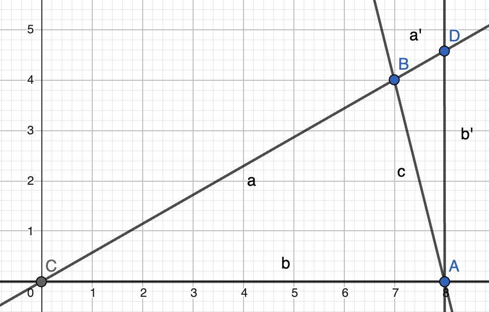

 (diagram from [geogebra](https://www.geogebra.org/graphing))

c = 30.875 found from [triangle-calculator](https://www.calculator.net/triangle-calculator.html?vc=20&vx=88.9&vy=88.9&va=&vz=&vb=&angleunits=d&x=Calculate) as target to base the rest on  
a = b = 88.9  
C = 20 &deg; 
A = B = 80 &deg; 

The distance of B from b is hb 
The distance of B from b' is hbprime  

hb = (a * b * math.sin(math.radians(C))) / b

